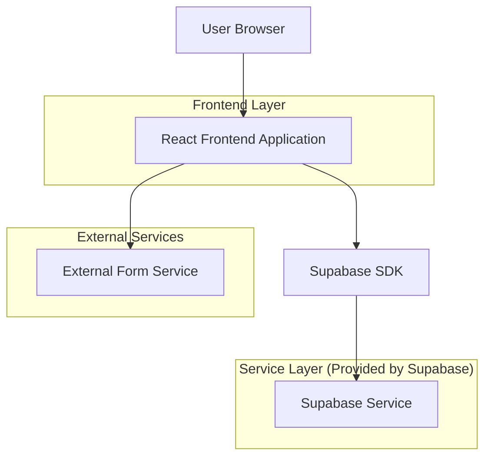
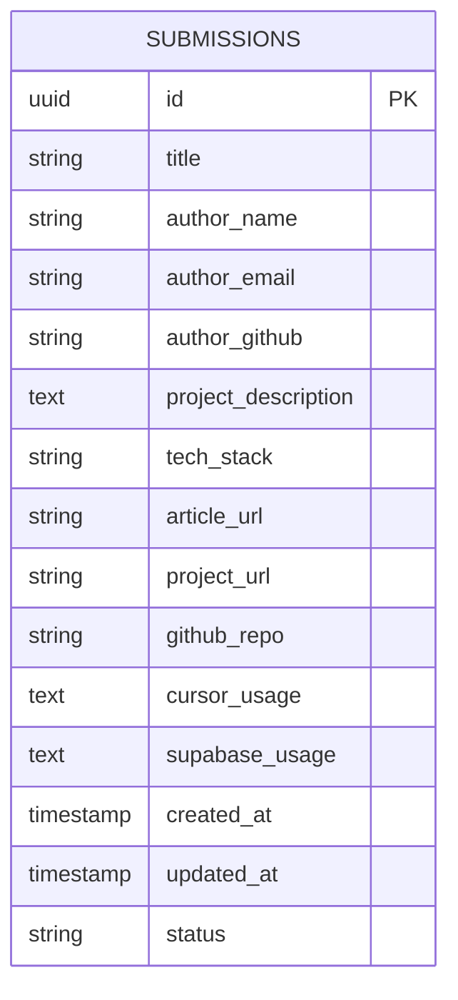

# 首届 Cursor 中文社区征文大赛官网技术架构文档

## 1. Architecture design



## 2. Technology Description

- Frontend: React@18 + TypeScript + Tailwind CSS@3 + Framer Motion + Vite
- Backend: Supabase (用于作品提交数据存储)
- 部署: Vercel 或 Netlify
- 表单服务: Formspree 或 Supabase Forms

## 3. Route definitions

| Route | Purpose |
|-------|---------|
| / | 首页，聚光灯开场效果和比赛概览 |
| /details | 比赛详情页，包含完整的比赛信息、奖励、流程、时间、规则 |
| /submit | 作品提交页，参赛作品提交表单 |
| /success | 提交成功页，确认提交状态 |

## 4. API definitions

### 4.1 Core API

作品提交相关
```
POST /api/submissions
```

Request:
| Param Name | Param Type | isRequired | Description |
|------------|------------|------------|-------------|
| title | string | true | 作品标题 |
| author_name | string | true | 作者姓名 |
| author_email | string | true | 作者邮箱 |
| author_github | string | false | GitHub 用户名 |
| project_description | string | true | 项目描述 |
| tech_stack | string | true | 使用的技术栈 |
| article_url | string | true | 技术文章链接 |
| project_url | string | false | 项目演示链接 |
| github_repo | string | false | 项目仓库链接 |
| cursor_usage | string | true | Cursor 使用说明 |
| supabase_usage | string | true | Supabase 使用说明 |

Response:
| Param Name | Param Type | Description |
|------------|------------|-------------|
| success | boolean | 提交状态 |
| message | string | 响应消息 |
| submission_id | string | 提交ID |

Example:
```json
{
  "title": "AI 驱动的任务管理系统",
  "author_name": "张三",
  "author_email": "zhangsan@example.com",
  "project_description": "基于 Cursor 和 Supabase 开发的智能任务管理应用",
  "tech_stack": "React, TypeScript, Supabase, Cursor AI",
  "article_url": "https://example.com/my-article",
  "cursor_usage": "使用 Cursor 的 AI 功能快速生成组件代码",
  "supabase_usage": "使用 Supabase 作为后端数据库和认证服务"
}
```

## 5. Data model

### 5.1 Data model definition



### 5.2 Data Definition Language

作品提交表 (submissions)
```sql
-- create table
CREATE TABLE submissions (
    id UUID PRIMARY KEY DEFAULT gen_random_uuid(),
    title VARCHAR(200) NOT NULL,
    author_name VARCHAR(100) NOT NULL,
    author_email VARCHAR(255) NOT NULL,
    author_github VARCHAR(100),
    project_description TEXT NOT NULL,
    tech_stack VARCHAR(500) NOT NULL,
    article_url VARCHAR(500) NOT NULL,
    project_url VARCHAR(500),
    github_repo VARCHAR(500),
    cursor_usage TEXT NOT NULL,
    supabase_usage TEXT NOT NULL,
    status VARCHAR(20) DEFAULT 'pending' CHECK (status IN ('pending', 'reviewing', 'approved', 'rejected')),
    created_at TIMESTAMP WITH TIME ZONE DEFAULT NOW(),
    updated_at TIMESTAMP WITH TIME ZONE DEFAULT NOW()
);

-- create indexes
CREATE INDEX idx_submissions_created_at ON submissions(created_at DESC);
CREATE INDEX idx_submissions_status ON submissions(status);
CREATE INDEX idx_submissions_author_email ON submissions(author_email);

-- Row Level Security (RLS)
ALTER TABLE submissions ENABLE ROW LEVEL SECURITY;

-- Allow anonymous users to insert submissions
CREATE POLICY "Allow anonymous submissions" ON submissions
    FOR INSERT TO anon
    WITH CHECK (true);

-- Allow authenticated users to view all submissions
CREATE POLICY "Allow authenticated users to view submissions" ON submissions
    FOR SELECT TO authenticated
    USING (true);

-- Grant permissions
GRANT INSERT ON submissions TO anon;
GRANT SELECT ON submissions TO authenticated;
GRANT ALL PRIVILEGES ON submissions TO authenticated;
```

## 6. Component Architecture

### 6.1 组件结构

```
src/
├── components/
│   ├── common/
│   │   ├── Header.tsx          # 导航栏组件
│   │   ├── Footer.tsx          # 页脚组件
│   │   └── SpotlightEffect.tsx # 聚光灯效果组件
│   ├── home/
│   │   ├── HeroSection.tsx     # 首页主视觉区域
│   │   ├── OverviewSection.tsx # 比赛概览
│   │   └── CodeBackground.tsx  # 代码背景装饰
│   ├── details/
│   │   ├── IntroSection.tsx    # 比赛介绍
│   │   ├── RewardsSection.tsx  # 奖励展示
│   │   ├── ProcessSection.tsx  # 参赛流程
│   │   ├── TimelineSection.tsx # 时间安排
│   │   ├── RulesSection.tsx    # 比赛规则
│   │   └── CallToAction.tsx    # 结尾号召
│   └── submit/
│       ├── SubmissionForm.tsx  # 提交表单
│       └── SubmissionGuide.tsx # 提交指南
├── pages/
│   ├── Home.tsx               # 首页
│   ├── Details.tsx            # 详情页
│   ├── Submit.tsx             # 提交页
│   └── Success.tsx            # 成功页
├── hooks/
│   ├── useSubmission.ts       # 提交相关逻辑
│   └── useAnimation.ts        # 动画效果钩子
├── utils/
│   ├── supabase.ts           # Supabase 客户端
│   └── animations.ts         # 动画配置
└── styles/
    └── globals.css           # 全局样式
```

### 6.2 关键技术实现

- **聚光灯效果**: 使用 CSS radial-gradient 和 Framer Motion 实现动态光晕
- **时间轴组件**: 响应式设计，移动端垂直布局，桌面端水平布局
- **表单验证**: 使用 React Hook Form + Zod 进行类型安全的表单验证
- **动画效果**: Framer Motion 实现页面切换和元素进入动画
- **响应式设计**: Tailwind CSS 断点系统，确保各设备完美适配