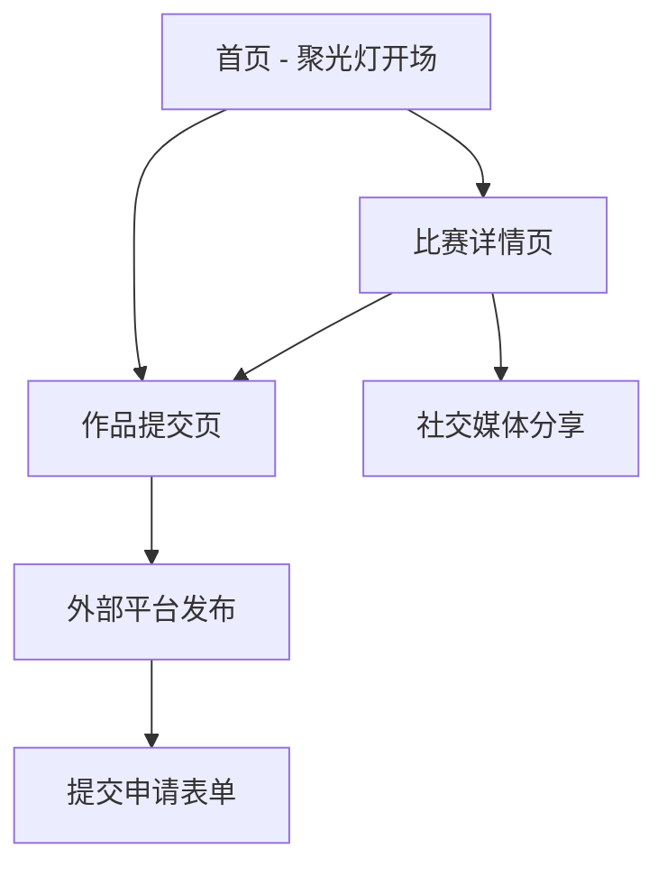

# 首届 Cursor 中文社区征文大赛官网产品需求文档

## 1. Product Overview

首届 Cursor 中文社区征文大赛官网是一个专为开发者社区打造的比赛宣传网站，采用黑白色调的极简科技风格，突出"聚光灯"与"舞台"主题。网站旨在吸引开发者参与比赛，展示比赛价值，并提供清晰的参赛流程指导。

- 核心目标：通过强烈的视觉冲击力和情感号召力，激发开发者参赛热情，体现技术社区的创新精神
- 目标用户：Cursor 用户、开发者社区成员、对 AI 编程工具感兴趣的技术人员
- 市场价值：建立 Cursor 中文社区品牌影响力，推广 AI 编程工具在中文开发者群体中的应用

## 2. Core Features

### 2.1 User Roles

| Role | Registration Method | Core Permissions |
|------|---------------------|------------------|
| 访客用户 | 无需注册 | 浏览所有内容、查看比赛信息 |
| 参赛者 | 通过外部链接提交作品 | 提交参赛作品、获取比赛更新 |

### 2.2 Feature Module

我们的比赛官网包含以下核心页面：

1. **首页**：聚光灯开场效果、比赛核心信息展示、导航菜单
2. **比赛详情页**：完整的比赛介绍、奖励说明、参赛流程、时间安排、比赛规则
3. **作品提交页**：参赛作品提交表单、提交指南

### 2.3 Page Details

| Page Name | Module Name | Feature description |
|-----------|-------------|---------------------|
| 首页 | Hero Section | 聚光灯动画效果，主标题"首届 Cursor 中文社区征文大赛，为你把聚光灯打开"，副标题展示，背景代码片段装饰 |
| 首页 | 导航栏 | 黑白极简设计，包含比赛详情、提交作品、联系我们等链接 |
| 首页 | 比赛概览 | 简要介绍比赛背景、主办方信息、核心亮点展示 |
| 比赛详情页 | 比赛介绍模块 | 详细说明比赛目的、背景、与阿里云数据库合作信息 |
| 比赛详情页 | 奖励展示模块 | 四大核心奖励：专家验证、云栖大会直通、现金奖励、影响力放大，配合图标展示 |
| 比赛详情页 | 参赛流程模块 | 三步流程：打磨作品、撰写文章、提交申请，时间轴设计 |
| 比赛详情页 | 时间安排模块 | 关键时间节点：申请期、评审期、公布期，横向时间轴展示 |
| 比赛详情页 | 规则说明模块 | 版权原创要求、核心技术要素、公平承诺说明 |
| 比赛详情页 | 结尾号召模块 | 情感化文案、主办方信息、合作伙伴 logo 展示 |
| 作品提交页 | 提交表单 | 作品标题、作者信息、项目描述、技术栈、文章链接等字段 |
| 作品提交页 | 提交指南 | 详细的提交要求、格式说明、注意事项 |

## 3. Core Process

### 用户操作流程

用户访问网站后，首先在首页感受聚光灯主题的视觉冲击，了解比赛基本信息。然后进入比赛详情页深入了解奖励、流程、时间安排和规则。最后通过作品提交页面完成参赛申请。

## 4. User Interface Design

### 4.1 Design Style

- **主色调**：纯黑色 (#000000) 和纯白色 (#FFFFFF)
- **辅助色**：深灰色 (#2A2A2A)、中灰色 (#666666)
- **按钮样式**：圆角矩形 (5px)，hover 时黑白反转效果
- **字体**：无衬线字体 Montserrat 或 Helvetica Neue，代码字体 Consolas
- **布局风格**：极简主义，大量留白，聚光灯和舞台元素
- **图标风格**：单色线条图标，简洁现代

### 4.2 Page Design Overview

| Page Name | Module Name | UI Elements |
|-----------|-------------|-------------|
| 首页 | Hero Section | 黑色背景，白色聚光灯效果，72pt 主标题，36pt 副标题，半透明代码片段装饰，淡入动画 |
| 首页 | 导航栏 | 顶部固定，黑色背景，白色文字，hover 效果，logo 展示 |
| 比赛详情页 | 奖励展示 | 白色背景，黑色文字，通行证图标，四个奖励项目配图标，项目符号列表 |
| 比赛详情页 | 流程模块 | 黑色背景，白色垂直时间轴，圆圈数字标记，步骤说明文字 |
| 比赛详情页 | 时间安排 | 深灰背景，横向时间轴，三个节点，日期高亮显示 |
| 作品提交页 | 表单设计 | 白色背景，黑色边框输入框，标签清晰，提交按钮突出 |

### 4.3 Responsiveness

网站采用移动端优先的响应式设计，适配桌面端、平板和手机。移动端字体缩小至 80%，间距压缩，图标按钮缩小至 70%，确保触摸友好和可读性。所有动画效果在移动端保持流畅。