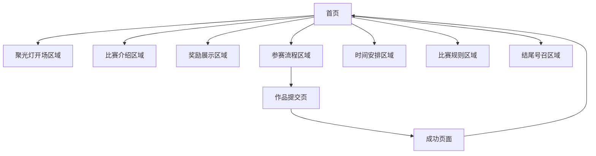

# 首届 Cursor 中文社区征文大赛官网 - 产品需求文档

## 1. 产品概述

首届 Cursor 中文社区征文大赛官网是一个专为开发者打造的比赛展示平台，采用黑白极简设计风格，以"聚光灯"和"舞台"为核心主题。网站旨在为开发者提供展示才华的舞台，打破传统比赛边界，搭建长期展示平台，寻找能持续发光的未来之星。

产品核心价值：为每一个优秀的开发者项目提供被看见、被认可、被推广的机会，通过技术比赛连接开发者与行业机遇。

## 2. 核心功能

### 2.1 用户角色

| 角色 | 访问方式 | 核心权限 |
|------|----------|----------|
| 访问者 | 直接访问网站 | 浏览比赛信息、查看规则、了解奖励 |
| 参赛者 | 通过提交表单参赛 | 提交作品、查看提交状态、获取参赛确认 |

### 2.2 功能模块

网站采用单页面设计，包含以下核心模块：

1. **聚光灯开场区域**：主视觉展示，情感化开场，聚光灯效果
2. **比赛介绍区域**：大赛背景、主办方信息、核心价值展示
3. **奖励展示区域**：四大核心奖励详细介绍，价值突出展示
4. **参赛流程区域**：三步参赛流程，操作指引，提交入口
5. **时间安排区域**：关键时间节点，可视化时间轴展示
6. **比赛规则区域**：简化规则说明，公平性承诺展示
7. **结尾号召区域**：情感化号召，合作伙伴展示
8. **作品提交页面**：独立提交表单页面，文件上传功能
9. **成功确认页面**：提交成功反馈页面

### 2.3 页面详情

| 页面名称 | 模块名称 | 功能描述 |
|----------|----------|----------|
| 首页 | 聚光灯开场区域 | 展示主标题"首届 Cursor 中文社区征文大赛，为你把聚光灯打开"，包含聚光灯动画效果、情感化文案、代码片段装饰元素 |
| 首页 | 比赛介绍区域 | 介绍大赛背景和意义，展示主办方Cursor中文社区和赞助方阿里云信息，包含阶梯式视觉设计 |
| 首页 | 奖励展示区域 | 展示四大核心奖励：顶级专家验证、云栖大会直通、现金奖励、影响力放大，包含通行证视觉元素和图标化说明 |
| 首页 | 参赛流程区域 | 展示三步参赛流程：打磨作品、撰写文章、提交申请，包含时间轴布局和提交按钮 |
| 首页 | 时间安排区域 | 展示关键时间节点：通行证申请(8月18日-9月18日)、后台甄选(9月18日-9月23日)、主角登场(9月24日) |
| 首页 | 比赛规则区域 | 展示简化规则：版权原创、核心要素、公平承诺，包含编号列表和重点突出 |
| 首页 | 结尾号召区域 | 情感化号召文案"我们，在聚光灯下等你"，包含舞台幕布效果和合作伙伴logo展示 |
| 首页 | 导航系统 | 固定顶部导航栏，包含各区域锚点链接、平滑滚动、当前区域高亮、回到顶部按钮 |
| 作品提交页 | 提交表单 | 包含参赛者信息填写、项目信息录入、文章链接提交、文件上传功能，具备表单验证 |
| 作品提交页 | 验证反馈 | 实时表单验证提示、错误信息展示、提交状态反馈 |
| 成功页面 | 提交确认 | 展示提交成功信息、后续流程说明、返回首页链接 |

## 3. 核心流程

### 3.1 用户浏览流程

用户访问网站后，通过以下流程了解比赛信息：
1. 进入首页，观看聚光灯开场动画
2. 通过导航栏或滚动浏览各个区域内容
3. 了解比赛背景、奖励、流程、时间、规则
4. 点击"提交作品"按钮进入提交页面

### 3.2 作品提交流程

参赛者提交作品的完整流程：
1. 在首页点击"提交作品"按钮
2. 跳转到作品提交页面
3. 填写个人信息（姓名、邮箱、联系方式）
4. 填写项目信息（项目名称、描述、技术栈）
5. 提交文章链接和相关文件
6. 表单验证通过后提交
7. 跳转到成功页面确认提交

### 3.3 页面导航流程

## 4. 用户界面设计

### 4.1 设计风格

**核心设计理念**：黑白极简、聚光灯主题、舞台概念

- **主色调**：纯黑色(#000000)、纯白色(#FFFFFF)
- **辅助色**：中性灰(#666666)、深灰色(#2A2A2A)
- **字体风格**：现代无衬线字体(Montserrat/Helvetica Neue)，代码字体(Consolas)
- **按钮风格**：极简矩形按钮，黑白反转悬停效果
- **布局风格**：单页面长滚动，固定顶部导航，区域化内容展示
- **图标风格**：单色线性图标，简洁几何形状
- **动画风格**：平滑过渡，聚光灯效果，淡入淡出

### 4.2 页面设计概览

| 页面名称 | 模块名称 | UI元素 |
|----------|----------|--------|
| 首页 | 聚光灯开场区域 | 纯黑背景，白色聚光灯效果，大标题(72pt)，副标题(36pt)，正文(18pt)，代码片段装饰，淡入动画 |
| 首页 | 比赛介绍区域 | 渐变背景(深灰到黑)，白色阶梯图形，标题(48pt)，正文(16pt)，品牌logo展示，阶梯淡入动画 |
| 首页 | 奖励展示区域 | 纯白背景，黑色通行证图标，标题(48pt)，奖励列表，单色图标(20x20px)，波浪分隔线，逐项淡入动画 |
| 首页 | 参赛流程区域 | 纯黑背景，白色时间轴，圆圈标记(20px)，步骤标题(18pt)，描述文字(14pt)，提交按钮，时间轴高亮动画 |
| 首页 | 时间安排区域 | 深灰背景，横向时间轴，白色节点(15px)，日期标题(18pt)，描述文字(14pt)，日历网格装饰，节点闪烁动画 |
| 首页 | 比赛规则区域 | 纯白背景，黑色垂直线，编号列表，规则标题(18pt)，描述文字(14pt)，黑色横线装饰，逐项淡入动画 |
| 首页 | 结尾号召区域 | 纯黑背景，白色聚光灯效果，标题(48pt)，正文(16pt)，舞台幕布图形，合作伙伴logo网格，光晕移动动画 |
| 首页 | 导航系统 | 固定顶部导航，黑色背景，白色文字，比赛标题，导航链接，提交按钮，高亮效果，平滑滚动 |
| 作品提交页 | 提交表单 | 黑色背景，白色表单容器，输入框，标签文字，提交按钮，验证提示，文件上传区域 |
| 成功页面 | 提交确认 | 黑色背景，白色内容区域，成功图标，确认文字，返回按钮，简洁布局 |

### 4.3 响应式设计

**设计原则**：移动端优先，渐进增强

- **移动端(≤768px)**：单列布局，字体缩小(标题36pt，正文12-14pt)，间距压缩80%，图标缩小70%
- **平板端(769px-1024px)**：双列布局，字体适中(标题48pt，正文14-16pt)，间距压缩90%
- **桌面端(≥1025px)**：多列布局，完整字体尺寸，标准间距，完整动画效果
- **触摸优化**：按钮最小44x44px，增大点击区域，优化滑动体验

## 5. 技术要求

### 5.1 性能要求

- **加载速度**：首屏加载时间 < 2秒
- **交互响应**：用户操作响应时间 < 100ms
- **动画流畅度**：保持60fps，避免卡顿
- **资源优化**：图片压缩，代码分割，懒加载

### 5.2 兼容性要求

- **浏览器支持**：Chrome 90+, Firefox 88+, Safari 14+, Edge 90+
- **移动端支持**：iOS Safari 14+, Android Chrome 90+
- **屏幕分辨率**：支持320px-2560px宽度范围
- **设备类型**：桌面端、平板、手机全覆盖

### 5.3 可访问性要求

- **颜色对比度**：符合WCAG 2.1 AA标准(对比度≥4.5:1)
- **键盘导航**：支持Tab键导航，焦点可见
- **屏幕阅读器**：语义化HTML，适当的ARIA标签
- **字体大小**：支持浏览器字体缩放

### 5.4 SEO要求

- **页面标题**：独特且描述性的title标签
- **元描述**：吸引人的meta description
- **结构化数据**：JSON-LD格式的结构化数据
- **URL结构**：简洁且语义化的URL
- **图片优化**：alt属性，适当的文件名

## 6. 内容规范

### 6.1 文案风格

- **语调**：专业而富有激情，技术性与情感化并重
- **用词**：简洁明了，避免过于复杂的技术术语
- **结构**：层次分明，重点突出，易于扫读
- **情感**：激发开发者的创造热情和参与欲望

### 6.2 视觉内容

- **图标**：统一的单色线性风格，简洁几何形状
- **装饰元素**：代码片段、几何图形、光效元素
- **品牌元素**：主办方和赞助方logo，保持黑白化处理
- **视觉层次**：通过字体大小、颜色对比建立清晰层次

## 7. 数据需求

### 7.1 表单数据收集

**参赛者信息**：
- 姓名（必填）
- 邮箱地址（必填）
- 联系电话（选填）
- 所在城市（选填）

**项目信息**：
- 项目名称（必填）
- 项目描述（必填）
- 技术栈（必填）
- GitHub链接（选填）
- 演示链接（选填）

**文章信息**：
- 文章标题（必填）
- 文章链接（必填）
- 发布平台（必填）
- 文章摘要（选填）

### 7.2 数据验证规则

- **邮箱格式**：标准邮箱格式验证
- **URL格式**：有效的HTTP/HTTPS链接
- **字符长度**：项目名称≤50字符，描述≤500字符
- **必填检查**：所有必填字段不能为空
- **文件类型**：支持PDF、DOC、DOCX格式
- **文件大小**：单个文件≤10MB

## 8. 安全要求

### 8.1 前端安全

- **XSS防护**：所有用户输入进行转义处理
- **CSRF防护**：表单提交包含CSRF令牌
- **输入验证**：客户端和服务端双重验证
- **敏感信息**：不在前端存储敏感数据

### 8.2 数据安全

- **数据传输**：使用HTTPS加密传输
- **数据存储**：敏感数据加密存储
- **访问控制**：适当的权限控制机制
- **数据备份**：定期数据备份策略

## 9. 监控和分析

### 9.1 用户行为分析

- **页面浏览**：各区域停留时间和跳出率
- **交互行为**：按钮点击率和表单完成率
- **转化漏斗**：从浏览到提交的转化路径
- **设备分析**：不同设备和浏览器的使用情况

### 9.2 性能监控

- **加载性能**：页面加载时间和资源加载情况
- **运行性能**：JavaScript执行时间和内存使用
- **错误监控**：JavaScript错误和网络错误
- **用户体验**：Core Web Vitals指标监控

## 10. 项目里程碑

### 10.1 开发阶段

**第一阶段：基础框架搭建**
- 项目初始化和技术栈配置
- 基础组件和样式系统建立
- 路由配置和页面结构搭建

**第二阶段：核心功能开发**
- 首页各区域组件开发
- 导航系统和动画效果实现
- 作品提交页面和表单功能

**第三阶段：优化和测试**
- 响应式设计优化
- 性能优化和兼容性测试
- 用户体验优化和bug修复

### 10.2 上线计划

**测试环境部署**：功能测试和用户验收测试
**生产环境部署**：正式上线和监控配置
**后期维护**：持续监控、bug修复和功能优化

---

**产品愿景**：为每一个优秀的开发者项目提供被看见的机会，让技术创新在聚光灯下闪闪发光。