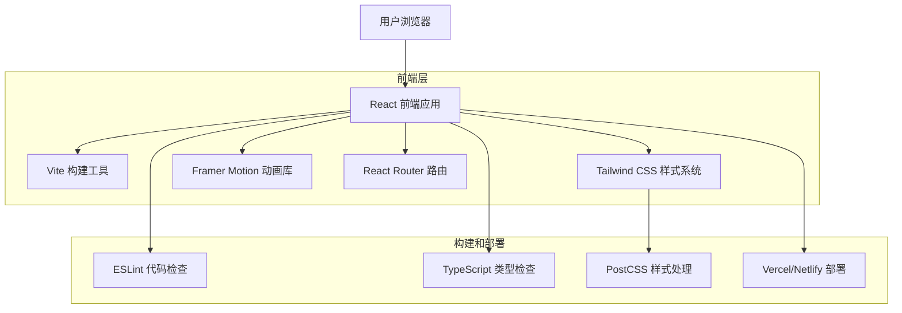

# 首届 Cursor 中文社区征文大赛官网 - 技术架构文档

## 1. 架构设计



## 2. 技术描述

### 2.1 核心技术栈

- **前端框架**：React@18 + TypeScript@5
- **构建工具**：Vite@5
- **样式框架**：Tailwind CSS@3
- **动画库**：Framer Motion@11
- **路由管理**：React Router@6
- **开发工具**：ESLint + Prettier

### 2.2 依赖包详情

**生产依赖**：
```json
{
  "react": "^18.2.0",
  "react-dom": "^18.2.0",
  "react-router-dom": "^6.8.0",
  "framer-motion": "^11.0.0",
  "lucide-react": "^0.263.0"
}
```

**开发依赖**：
```json
{
  "@types/react": "^18.2.0",
  "@types/react-dom": "^18.2.0",
  "@typescript-eslint/eslint-plugin": "^6.0.0",
  "@vitejs/plugin-react": "^4.0.0",
  "autoprefixer": "^10.4.14",
  "eslint": "^8.45.0",
  "postcss": "^8.4.24",
  "tailwindcss": "^3.3.0",
  "typescript": "^5.0.2",
  "vite": "^5.0.0"
}
```

## 3. 路由定义

| 路由 | 组件 | 功能描述 |
|------|------|----------|
| / | Home | 首页，包含所有比赛信息区域和导航系统 |
| /submit | Submit | 作品提交页面，包含表单和文件上传功能 |
| /success | Success | 提交成功页面，显示确认信息和后续指引 |
| /* | NotFound | 404错误页面，处理无效路由访问 |

### 3.1 路由配置

```typescript
// src/App.tsx
import { BrowserRouter as Router, Routes, Route } from 'react-router-dom';
import Home from './pages/Home';
import Submit from './pages/Submit';
import Success from './pages/Success';
import NotFound from './pages/NotFound';

function App() {
  return (
    <Router>
      <Routes>
        <Route path="/" element={<Home />} />
        <Route path="/submit" element={<Submit />} />
        <Route path="/success" element={<Success />} />
        <Route path="*" element={<NotFound />} />
      </Routes>
    </Router>
  );
}
```

## 4. 组件架构

### 4.1 组件层次结构

```
src/
├── components/
│   ├── ui/                    # 基础UI组件
│   │   ├── Button.tsx         # 按钮组件
│   │   ├── Input.tsx          # 输入框组件
│   │   ├── Textarea.tsx       # 文本域组件
│   │   └── FileUpload.tsx     # 文件上传组件
│   ├── sections/              # 页面区域组件
│   │   ├── HeroSection.tsx    # 聚光灯开场区域
│   │   ├── IntroSection.tsx   # 比赛介绍区域
│   │   ├── RewardsSection.tsx # 奖励展示区域
│   │   ├── ProcessSection.tsx # 参赛流程区域
│   │   ├── ScheduleSection.tsx# 时间安排区域
│   │   ├── RulesSection.tsx   # 比赛规则区域
│   │   └── CallToActionSection.tsx # 结尾号召区域
│   ├── layout/                # 布局组件
│   │   ├── Navigation.tsx     # 导航栏组件
│   │   ├── Footer.tsx         # 页脚组件
│   │   └── Layout.tsx         # 页面布局组件
│   └── effects/               # 特效组件
│       ├── SpotlightEffect.tsx# 聚光灯效果
│       ├── CodeSnippet.tsx    # 代码片段装饰
│       └── AnimatedTimeline.tsx# 动画时间轴
├── pages/                     # 页面组件
│   ├── Home.tsx              # 首页
│   ├── Submit.tsx            # 提交页面
│   ├── Success.tsx           # 成功页面
│   └── NotFound.tsx          # 404页面
├── hooks/                     # 自定义Hook
│   ├── useScrollSpy.ts       # 滚动监听Hook
│   ├── useFormValidation.ts  # 表单验证Hook
│   └── useLocalStorage.ts    # 本地存储Hook
├── lib/                       # 工具函数
│   ├── utils.ts              # 通用工具函数
│   ├── validation.ts         # 表单验证函数
│   └── constants.ts          # 常量定义
└── types/                     # TypeScript类型定义
    ├── form.ts               # 表单相关类型
    └── common.ts             # 通用类型
```

### 4.2 核心组件设计

**HeroSection 组件**：
```typescript
interface HeroSectionProps {
  className?: string;
}

const HeroSection: React.FC<HeroSectionProps> = ({ className }) => {
  return (
    <section className={cn("relative min-h-screen bg-black", className)}>
      <SpotlightEffect />
      <div className="container mx-auto px-4 py-20">
        <motion.h1 
          initial={{ opacity: 0, y: 20 }}
          animate={{ opacity: 1, y: 0 }}
          transition={{ duration: 0.5 }}
          className="text-6xl font-bold text-white text-center mb-6"
        >
          首届 Cursor 中文社区征文大赛
        </motion.h1>
        <motion.h2 
          initial={{ opacity: 0, y: 20 }}
          animate={{ opacity: 1, y: 0 }}
          transition={{ duration: 0.5, delay: 0.2 }}
          className="text-3xl font-light text-white/80 text-center mb-12"
        >
          为你把聚光灯打开
        </motion.h2>
        {/* 更多内容 */}
      </div>
    </section>
  );
};
```

**Navigation 组件**：
```typescript
interface NavigationProps {
  activeSection: string;
}

const Navigation: React.FC<NavigationProps> = ({ activeSection }) => {
  const sections = [
    { id: 'hero', label: '开场' },
    { id: 'intro', label: '介绍' },
    { id: 'rewards', label: '奖励' },
    { id: 'process', label: '流程' },
    { id: 'schedule', label: '时间' },
    { id: 'rules', label: '规则' },
    { id: 'cta', label: '号召' }
  ];

  const scrollToSection = (sectionId: string) => {
    const element = document.getElementById(sectionId);
    element?.scrollIntoView({ behavior: 'smooth' });
  };

  return (
    <nav className="fixed top-0 left-0 right-0 z-50 bg-black/90 backdrop-blur-sm">
      <div className="container mx-auto px-4 py-4 flex justify-between items-center">
        <h1 className="text-xl font-bold text-white">Cursor 征文大赛</h1>
        <ul className="flex space-x-6">
          {sections.map((section) => (
            <li key={section.id}>
              <button
                onClick={() => scrollToSection(section.id)}
                className={cn(
                  "text-white/70 hover:text-white transition-colors",
                  activeSection === section.id && "text-white font-semibold"
                )}
              >
                {section.label}
              </button>
            </li>
          ))}
        </ul>
        <Button 
          onClick={() => window.location.href = '/submit'}
          className="bg-white text-black hover:bg-gray-100"
        >
          提交作品
        </Button>
      </div>
    </nav>
  );
};
```

## 5. 样式系统

### 5.1 Tailwind CSS 配置

```javascript
// tailwind.config.js
module.exports = {
  content: ['./index.html', './src/**/*.{js,ts,jsx,tsx}'],
  theme: {
    extend: {
      colors: {
        black: '#000000',
        white: '#FFFFFF',
        gray: {
          400: '#666666',
          600: '#2A2A2A'
        }
      },
      fontFamily: {
        sans: ['Helvetica Neue', 'Arial', 'sans-serif'],
        title: ['Montserrat', 'Helvetica Neue', 'sans-serif'],
        code: ['Consolas', 'Monaco', 'monospace']
      },
      fontSize: {
        'hero': '72px',
        'title': '48px',
        'subtitle': '36px',
        'body': '16px',
        'small': '14px'
      },
      spacing: {
        '18': '4.5rem',
        '72': '18rem',
        '84': '21rem',
        '96': '24rem'
      },
      animation: {
        'spotlight': 'spotlight 5s ease-in-out infinite',
        'fade-in': 'fadeIn 0.5s ease-in-out',
        'slide-up': 'slideUp 0.5s ease-out'
      },
      keyframes: {
        spotlight: {
          '0%, 100%': { transform: 'translateX(-10px)' },
          '50%': { transform: 'translateX(10px)' }
        },
        fadeIn: {
          '0%': { opacity: '0' },
          '100%': { opacity: '1' }
        },
        slideUp: {
          '0%': { opacity: '0', transform: 'translateY(20px)' },
          '100%': { opacity: '1', transform: 'translateY(0)' }
        }
      }
    }
  },
  plugins: []
};
```

### 5.2 自定义CSS样式

```css
/* src/index.css */
@tailwind base;
@tailwind components;
@tailwind utilities;

@layer base {
  html {
    scroll-behavior: smooth;
  }
  
  body {
    font-family: 'Helvetica Neue', Arial, sans-serif;
    line-height: 1.5;
    -webkit-font-smoothing: antialiased;
    -moz-osx-font-smoothing: grayscale;
  }
}

@layer components {
  .spotlight-effect {
    background: radial-gradient(
      circle at center,
      rgba(255, 255, 255, 0.1) 0%,
      rgba(255, 255, 255, 0.05) 30%,
      transparent 70%
    );
    animation: spotlight 5s ease-in-out infinite;
  }
  
  .code-snippet {
    font-family: 'Consolas', 'Monaco', monospace;
    font-size: 12px;
    opacity: 0.3;
    color: white;
    white-space: pre;
    line-height: 1.4;
  }
  
  .timeline-node {
    position: relative;
    width: 20px;
    height: 20px;
    border-radius: 50%;
    background: white;
    border: 2px solid white;
  }
  
  .timeline-node::before {
    content: '';
    position: absolute;
    top: 50%;
    left: 100%;
    width: 50px;
    height: 2px;
    background: white;
    transform: translateY(-50%);
  }
  
  .timeline-node:last-child::before {
    display: none;
  }
}

@layer utilities {
  .text-shadow {
    text-shadow: 0 2px 4px rgba(0, 0, 0, 0.1);
  }
  
  .backdrop-blur-xs {
    backdrop-filter: blur(2px);
  }
  
  .gradient-text {
    background: linear-gradient(45deg, #ffffff, #cccccc);
    -webkit-background-clip: text;
    -webkit-text-fill-color: transparent;
    background-clip: text;
  }
}
```

## 6. 动画系统

### 6.1 Framer Motion 配置

**页面过渡动画**：
```typescript
// src/lib/animations.ts
export const pageVariants = {
  initial: {
    opacity: 0,
    y: 20
  },
  in: {
    opacity: 1,
    y: 0
  },
  out: {
    opacity: 0,
    y: -20
  }
};

export const pageTransition = {
  type: 'tween',
  ease: 'anticipate',
  duration: 0.5
};

export const staggerContainer = {
  initial: {},
  animate: {
    transition: {
      staggerChildren: 0.1
    }
  }
};

export const fadeInUp = {
  initial: {
    opacity: 0,
    y: 20
  },
  animate: {
    opacity: 1,
    y: 0,
    transition: {
      duration: 0.5,
      ease: 'easeOut'
    }
  }
};
```

**聚光灯效果组件**：
```typescript
// src/components/effects/SpotlightEffect.tsx
const SpotlightEffect: React.FC = () => {
  return (
    <motion.div
      className="absolute inset-0 pointer-events-none"
      initial={{ opacity: 0 }}
      animate={{ opacity: 1 }}
      transition={{ duration: 1 }}
    >
      <motion.div
        className="absolute top-0 left-1/2 w-96 h-96 spotlight-effect"
        animate={{
          x: [-20, 20, -20],
          y: [0, 10, 0]
        }}
        transition={{
          duration: 5,
          repeat: Infinity,
          ease: 'easeInOut'
        }}
        style={{
          transform: 'translateX(-50%)'
        }}
      />
    </motion.div>
  );
};
```

### 6.2 滚动动画

```typescript
// src/hooks/useScrollAnimation.ts
import { useInView } from 'framer-motion';
import { useRef } from 'react';

export const useScrollAnimation = () => {
  const ref = useRef(null);
  const isInView = useInView(ref, { once: true, margin: '-100px' });
  
  return {
    ref,
    isInView,
    variants: {
      hidden: { opacity: 0, y: 50 },
      visible: { 
        opacity: 1, 
        y: 0,
        transition: {
          duration: 0.6,
          ease: 'easeOut'
        }
      }
    }
  };
};
```

## 7. 状态管理

### 7.1 React Context

```typescript
// src/contexts/AppContext.tsx
interface AppContextType {
  activeSection: string;
  setActiveSection: (section: string) => void;
  isSubmitting: boolean;
  setIsSubmitting: (submitting: boolean) => void;
}

const AppContext = createContext<AppContextType | undefined>(undefined);

export const AppProvider: React.FC<{ children: React.ReactNode }> = ({ children }) => {
  const [activeSection, setActiveSection] = useState('hero');
  const [isSubmitting, setIsSubmitting] = useState(false);
  
  return (
    <AppContext.Provider value={{
      activeSection,
      setActiveSection,
      isSubmitting,
      setIsSubmitting
    }}>
      {children}
    </AppContext.Provider>
  );
};

export const useAppContext = () => {
  const context = useContext(AppContext);
  if (!context) {
    throw new Error('useAppContext must be used within AppProvider');
  }
  return context;
};
```

### 7.2 表单状态管理

```typescript
// src/hooks/useFormState.ts
interface FormData {
  name: string;
  email: string;
  phone?: string;
  city?: string;
  projectName: string;
  projectDescription: string;
  techStack: string;
  githubUrl?: string;
  demoUrl?: string;
  articleTitle: string;
  articleUrl: string;
  platform: string;
  articleSummary?: string;
}

export const useFormState = () => {
  const [formData, setFormData] = useState<FormData>({
    name: '',
    email: '',
    projectName: '',
    projectDescription: '',
    techStack: '',
    articleTitle: '',
    articleUrl: '',
    platform: ''
  });
  
  const [errors, setErrors] = useState<Partial<FormData>>({});
  const [isValid, setIsValid] = useState(false);
  
  const updateField = (field: keyof FormData, value: string) => {
    setFormData(prev => ({ ...prev, [field]: value }));
    validateField(field, value);
  };
  
  const validateField = (field: keyof FormData, value: string) => {
    // 验证逻辑
  };
  
  return {
    formData,
    errors,
    isValid,
    updateField,
    validateForm: () => validateAllFields(formData)
  };
};
```

## 8. 性能优化

### 8.1 代码分割

```typescript
// src/App.tsx
import { lazy, Suspense } from 'react';
import LoadingSpinner from './components/ui/LoadingSpinner';

const Home = lazy(() => import('./pages/Home'));
const Submit = lazy(() => import('./pages/Submit'));
const Success = lazy(() => import('./pages/Success'));

function App() {
  return (
    <Router>
      <Suspense fallback={<LoadingSpinner />}>
        <Routes>
          <Route path="/" element={<Home />} />
          <Route path="/submit" element={<Submit />} />
          <Route path="/success" element={<Success />} />
        </Routes>
      </Suspense>
    </Router>
  );
}
```

### 8.2 图片优化

```typescript
// src/components/ui/OptimizedImage.tsx
interface OptimizedImageProps {
  src: string;
  alt: string;
  width?: number;
  height?: number;
  className?: string;
}

const OptimizedImage: React.FC<OptimizedImageProps> = ({
  src,
  alt,
  width,
  height,
  className
}) => {
  const [isLoaded, setIsLoaded] = useState(false);
  const [error, setError] = useState(false);
  
  return (
    <div className={cn("relative overflow-hidden", className)}>
      {!isLoaded && !error && (
        <div className="absolute inset-0 bg-gray-200 animate-pulse" />
      )}
       setIsLoaded(true)}
        onError={() => setError(true)}
        className={cn(
          "transition-opacity duration-300",
          isLoaded ? "opacity-100" : "opacity-0"
        )}
      />
    </div>
  );
};
```

### 8.3 虚拟滚动

```typescript
// src/hooks/useVirtualScroll.ts
export const useVirtualScroll = (itemCount: number, itemHeight: number) => {
  const [scrollTop, setScrollTop] = useState(0);
  const [containerHeight, setContainerHeight] = useState(0);
  
  const startIndex = Math.floor(scrollTop / itemHeight);
  const endIndex = Math.min(
    startIndex + Math.ceil(containerHeight / itemHeight) + 1,
    itemCount
  );
  
  const visibleItems = [];
  for (let i = startIndex; i < endIndex; i++) {
    visibleItems.push(i);
  }
  
  return {
    visibleItems,
    totalHeight: itemCount * itemHeight,
    offsetY: startIndex * itemHeight,
    onScroll: (e: React.UIEvent<HTMLDivElement>) => {
      setScrollTop(e.currentTarget.scrollTop);
    },
    onResize: (height: number) => {
      setContainerHeight(height);
    }
  };
};
```

## 9. 构建和部署

### 9.1 Vite 配置

```typescript
// vite.config.ts
import { defineConfig } from 'vite';
import react from '@vitejs/plugin-react';
import path from 'path';

export default defineConfig({
  plugins: [react()],
  resolve: {
    alias: {
      '@': path.resolve(__dirname, './src')
    }
  },
  build: {
    outDir: 'dist',
    sourcemap: true,
    rollupOptions: {
      output: {
        manualChunks: {
          vendor: ['react', 'react-dom'],
          router: ['react-router-dom'],
          animation: ['framer-motion']
        }
      }
    }
  },
  server: {
    port: 5173,
    host: true
  },
  preview: {
    port: 4173
  }
});
```

### 9.2 部署配置

**Vercel 配置**：
```json
// vercel.json
{
  "rewrites": [
    {
      "source": "/(.*)",
      "destination": "/index.html"
    }
  ],
  "headers": [
    {
      "source": "/(.*)",
      "headers": [
        {
          "key": "X-Content-Type-Options",
          "value": "nosniff"
        },
        {
          "key": "X-Frame-Options",
          "value": "DENY"
        },
        {
          "key": "X-XSS-Protection",
          "value": "1; mode=block"
        }
      ]
    }
  ]
}
```

**Netlify 配置**：
```toml
# netlify.toml
[build]
  publish = "dist"
  command = "npm run build"

[[redirects]]
  from = "/*"
  to = "/index.html"
  status = 200

[build.environment]
  NODE_VERSION = "18"
```

### 9.3 CI/CD 流程

```yaml
# .github/workflows/deploy.yml
name: Deploy to Production

on:
  push:
    branches: [main]

jobs:
  build-and-deploy:
    runs-on: ubuntu-latest
    
    steps:
    - uses: actions/checkout@v3
    
    - name: Setup Node.js
      uses: actions/setup-node@v3
      with:
        node-version: '18'
        cache: 'npm'
    
    - name: Install dependencies
      run: npm ci
    
    - name: Run tests
      run: npm run test
    
    - name: Build project
      run: npm run build
    
    - name: Deploy to Vercel
      uses: amondnet/vercel-action@v20
      with:
        vercel-token: ${{ secrets.VERCEL_TOKEN }}
        vercel-org-id: ${{ secrets.ORG_ID }}
        vercel-project-id: ${{ secrets.PROJECT_ID }}
        vercel-args: '--prod'
```

## 10. 监控和分析

### 10.1 性能监控

```typescript
// src/lib/analytics.ts
export const trackPageView = (page: string) => {
  if (typeof window !== 'undefined' && window.gtag) {
    window.gtag('config', 'GA_MEASUREMENT_ID', {
      page_title: page,
      page_location: window.location.href
    });
  }
};

export const trackEvent = (action: string, category: string, label?: string) => {
  if (typeof window !== 'undefined' && window.gtag) {
    window.gtag('event', action, {
      event_category: category,
      event_label: label
    });
  }
};

export const trackFormSubmission = (formType: string, success: boolean) => {
  trackEvent(
    success ? 'form_submit_success' : 'form_submit_error',
    'form',
    formType
  );
};
```

### 10.2 错误监控

```typescript
// src/lib/errorTracking.ts
class ErrorBoundary extends React.Component<
  { children: React.ReactNode },
  { hasError: boolean }
> {
  constructor(props: { children: React.ReactNode }) {
    super(props);
    this.state = { hasError: false };
  }

  static getDerivedStateFromError(error: Error) {
    return { hasError: true };
  }

  componentDidCatch(error: Error, errorInfo: React.ErrorInfo) {
    console.error('Error caught by boundary:', error, errorInfo);
    
    // 发送错误到监控服务
    if (typeof window !== 'undefined') {
      window.gtag?.('event', 'exception', {
        description: error.message,
        fatal: false
      });
    }
  }

  render() {
    if (this.state.hasError) {
      return (
        <div className="min-h-screen bg-black text-white flex items-center justify-center">
          <div className="text-center">
            <h1 className="text-2xl font-bold mb-4">出现了一些问题</h1>
            <p className="mb-4">页面遇到了错误，请刷新页面重试。</p>
            <button 
              onClick={() => window.location.reload()}
              className="bg-white text-black px-6 py-2 rounded hover:bg-gray-100"
            >
              刷新页面
            </button>
          </div>
        </div>
      );
    }

    return this.props.children;
  }
}
```

---

**技术架构总结**：本项目采用现代化的前端技术栈，以React 18为核心，结合TypeScript提供类型安全，使用Tailwind CSS实现黑白极简设计，通过Framer Motion创造流畅的动画效果。整体架构注重性能优化、用户体验和可维护性，确保网站在各种设备和浏览器上都能提供优秀的访问体验。